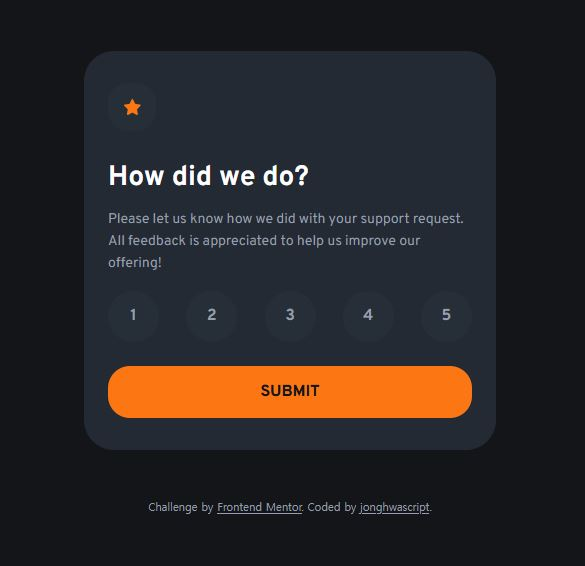

# Frontend Mentor - Interactive rating component solution

This is my solution to the [Interactive rating component challenge on Frontend Mentor](https://www.frontendmentor.io/challenges/interactive-rating-component-koxpeBUmI). This project helped me practice semantic HTML, responsive SCSS, JavaScript form handling, and accessible interaction states.

## Table of contents

- [Overview](#overview)
  - [The challenge](#the-challenge)
  - [Links](#links)
- [My process](#my-process)
  - [Built with](#built-with)
  - [Local development](#local-development)
  - [What I learned](#what-i-learned)
  - [Improvements — September 25, 2026](#improvements--september-25-2026)
  - [Validation](#validation)
  - [Continued development](#continued-development)
  - [AI collaboration](#ai-collaboration)
- [Author](#author)
- [Acknowledgments](#acknowledgments)

## Overview

### The challenge

Users should be able to:

- View a responsive rating card on different screen sizes.
- Identify hover, selected, and keyboard focus states.
- Select and submit a rating from 1 to 5.
- Receive an error message when submitting without a rating.
- See their selected rating on a separate thank-you page.

The selected rating is passed through a URL query parameter, such as `thanks.html?rating=4`. The thank-you page validates this value before displaying it. Missing or invalid values redirect visitors to the rating page. This is a frontend demo; ratings are not stored on a server.

### Screenshot

### Links
- Solution URL: [Repository](https://github.com/jonghwascript/interactive-rating-component)
- Live Site URL: [Live site](https://jonghwascript.github.io/interactive-rating-component)

## My process

### Built with

- Semantic HTML, including `form`, `fieldset`, `legend`, and native radio inputs
- SCSS variables, mixins, and reusable layout classes
- Flexbox and CSS custom properties
- Fluid sizing with `clamp()`, `rem`, and viewport units
- CSS `:has()` and `:focus-visible` for interaction states
- Vanilla JavaScript and `URLSearchParams`
- Gulp for compiling SCSS, processing HTML, copying assets, and watching changes

The rating logic uses native JavaScript APIs without jQuery.

### Local development

1. Run `npm install` to install the development dependencies.
2. Run `npm run dev` to build the project and watch source files for changes.
3. Set the local static server's document root to `dist` and open its root URL (`/`). This serves the generated `dist/index.html`. The Gulp task does not start a web server.

Other commands:

- `npm run build`: rebuild the generated files in `dist`.
- `npm run format`: format the source files using the Gulp Prettier task.

Edit the files in `src`, rather than the generated files in `dist`. The rating page is built from `src/pages/index.html` into `dist/index.html`. The repository root's `index.html` redirects to that built page. Generated files in `dist` are tracked, so rebuild them after source changes before committing. GitHub Pages publishes the `dist` directory using the deployment workflow.

### What I learned

**A visible button shape and its clickable area must match.** Initially, the circular dimensions belonged to the list item, while its label only covered the number. Making the label fill its parent made the whole circle selectable.

**Radio buttons have their own keyboard behavior.** Tab enters the rating group, arrow keys move between options, and another Tab moves to the next control. The label displays the focus outline, while its nested input receives focus.

**Focus and selection communicate different things.** An outer outline shows the current keyboard position. An orange background and an underline show the selected rating. Hover uses a white background so that moving the pointer does not look like selecting another option.

**Error messages need context.** The fieldset references the error message through `aria-describedby`. JavaScript sets `aria-invalid` after an invalid submission and removes it when the user changes the rating. The existing alert region announces newly displayed errors; the description relationship associates that message with the rating group.

**Shared scripts must account for different pages.** The thank-you page has no rating form. Looking up the fieldset only after confirming that the form exists prevents an error from stopping the thank-you message from rendering.

**Relative units help sizes follow the root font size.** Pixel lengths in `src/scss/style.scss` were converted using `16px = 1rem`. This preserves their original dimensions at a 16px root font size while allowing them to scale with that root size. The viewport terms inside `clamp()` remain unchanged.

### Improvements — September 25, 2026

- Implemented rating validation, navigation, and the selected-rating message on the thank-you page.
- Connected the shared script to the thank-you page and rendered the result as one text string to preserve natural word spacing.
- Expanded each rating label to cover its circular option.
- Added a visible keyboard focus outline with `:has(input:focus-visible)`.
- Distinguished selected options from hovered options with an orange background and an underline.
- Replaced the dark footer link color with `$Grey-500` to improve contrast against the page background.
- Connected the rating fieldset to the error message and added error-state updates through `aria-invalid`.
- Moved the fieldset lookup inside the form existence check to keep the shared script safe on both pages.
- Introduced `.rating-option` on all five labels and moved its styles outside the deeply nested `#main` rule.
- Removed the invalid `padding-block: auto` declaration.
- Converted 42 pixel values in `src/scss/style.scss` to `rem`, including spacing, radii, image dimensions, and focus outlines. Pixel values in imported SCSS files were outside this conversion's scope.
- Kept the design's minimum 42 × 42px rating dimensions, represented by `2.625rem` at a 16px root font size.

### Validation

During development, I manually confirmed keyboard navigation, submission without a rating, clearing the error after selecting a rating, and displaying the selected value on the thank-you page.

Sass compilation, the CSS build, and JavaScript syntax checks passed during the improvement work. Earlier isolated JavaScript checks covered all five ratings and missing or invalid rating values. These checks do not replace a complete browser test of the final project.

No automated lint or accessibility audit was run. Screen-reader behavior, the final layout across mobile/tablet/desktop sizes, and usability at 200% browser zoom still need verification. The `npm test` command is currently a placeholder, not a configured test suite.

### Continued development

- Check the final pages at 375px, 768px, and 1440px widths and at 200% browser zoom.
- Test error descriptions and announcements with a screen reader.
- Continue simplifying deeply nested selectors where it makes the styles easier to maintain.
- Review remaining pixel values in shared typography and layout files separately.
- Remove unused dependencies and starter styles when they are no longer needed.

### AI collaboration

I used Codex to inspect source files, diagnose interaction issues, and review accessibility and styling concerns. Codex implemented the initial rating behavior and converted the pixel values in `style.scss` to `rem`. I worked through the later improvements step by step, edited the source, and manually checked the main interaction flows.

The most useful part of this collaboration was understanding why each change mattered: matching click areas to visible controls, separating keyboard focus from selection, and connecting errors to their related inputs. Source review and build checks were kept separate from browser behavior that had not yet been tested.

## Author

- Frontend Mentor — [@jonghwascript](https://www.frontendmentor.io/profile/jonghwascript)
- GitHub — [@jonghwascript](https://github.com/jonghwascript)

## Acknowledgments

Thanks to Frontend Mentor for the challenge and design assets.
